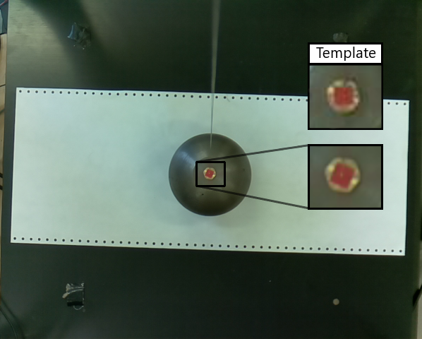
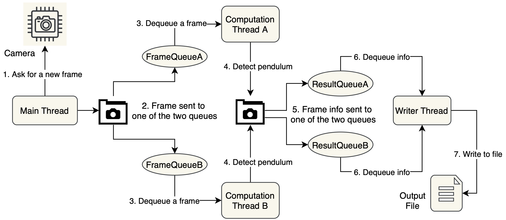
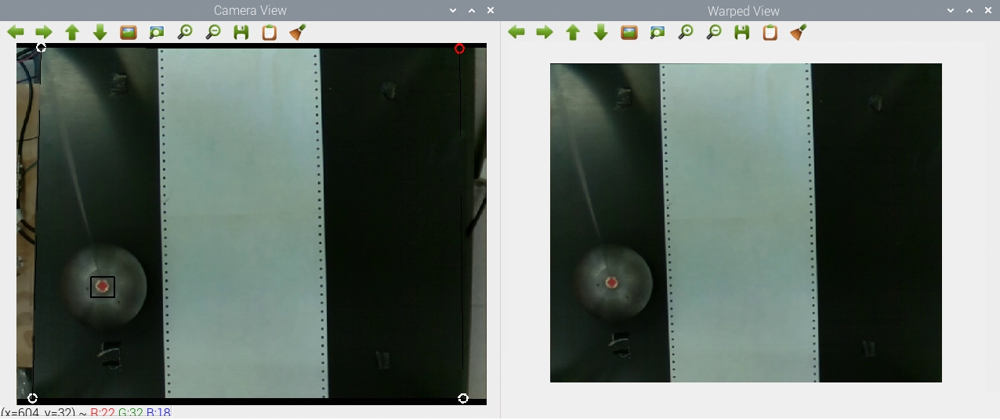
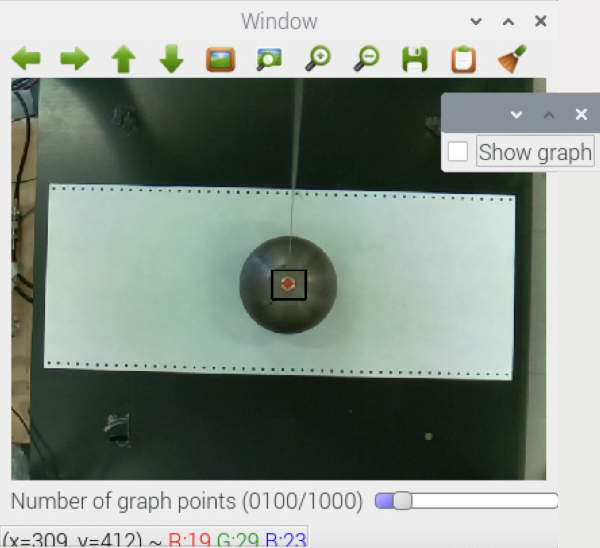
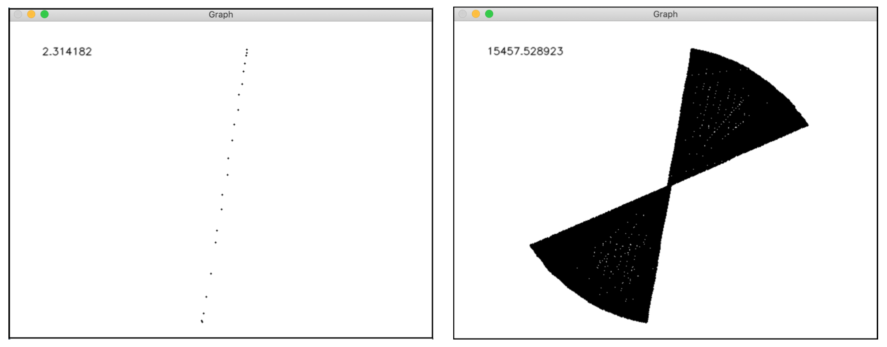

# Foucault pendulum tracking system


## Abstract
The purpose of this project is to develop a program capable of tracking a Foucault pendulum with the aim of collecting motion data that can be compared with the expected theoretical trend. Although the design is intended for use with a foucault pendulum, the system is generic enough to be employed to obtain information about the motion of any moving object. The system also features a tool for correcting perspective distortion that can be used without having to physically access the camera to calibrate it.

For a detalied description go to [About the project](#about-the-project).

## Compile & Run

### Requirements
- C++ 11
- OpenCV (version 4.1.0)
- pthreads

**Note:** the program has not been tested on newer versions than those listed.


### Compile
In order to use the program it first needs to be compiled. We first move to the directory where it is located, for example:

```cd Desktop/ProjectFolder/release/source```

Then to compile:
```
g++ calibration.cpp main.cpp offlineGraph.cpp −o tracciamentoPendolo −I/usr/local/include/opencv4/ −L/usr/local/lib −I/home/pi/Desktop/ProjectFolder/headers −lopencv_core −lopencv_imgproc −lopencv_highgui −lopencv_ml −lopencv_video −lopencv_features2d −lopencv_calib3d −lopencv_objdetect −lopencv_flann −lopencv_videoio −lopencv_imgcodecs −lpthread
```

### Run
To run the program in tracking mode, simply move to the folder that contains the compiled files and invoke the command ./tracciamentoPendolo
The following optional parameters allow you to start the program in a specific mode:
- ```-c``` or ```-calibrate``` to execute the program in calibration mode.
- ```-g``` or ```-graph``` to execute the program in offline mode, i.e to draw the graph of the points from a CSV file. After starting, the program will ask for the **relative path** to the CSV file.
- ```-h``` or ```-help``` to obtain info about the command line arguments available.
To interrupt the execution type ```Ctrl + c``` inside the console or simply close it. 

**Note:** it is strongly recommended to start the calibration mode the first time you run the program. However, this is not a mandatory step: at each run the system asks whether or not to apply the perspective correction.

### Repository
- The ```documentation``` folder contains further information and the user manual. <sup>[1](#myfootnote1)</sup>
- The ```images``` folder contains the images included in this document. 
- The file ```release/template.png``` is the template image used for detection.
- The file ```release/calibration.txt``` is an example of calibration file generated by the program after configuring the perspective correction.

## About the project

### Hardware
The hardware consists of:
- A Foucault pendulum.
- An intermittent electromagnetic coil placed under the center of the base of the pendulum. The magnetic field counteracts the damping of the oscillations and keeps the pendulum moving.
- A <a href="https://www.raspberrypi.org/products/raspberry-pi-4-model-b/specifications/">Raspberry Pi 4</a>.
- A camera placed over the pendulum and connected to the Raspberry Pi. The camera frames the pendulum from above but not perpendicularly to the base of the structure: the camera is therefore off-centre and tilted. To eliminate the distortion that occurs due to camera tilting, we developed a [remote camera calibration system](#perspective-correction).

### Requirements
The system needs to comply with the following requirements:
- Locate the center of the pendulum in real-time for each frame captured by the camera.
- Collect at least 5 coordinates per second. 
- Apply a perspective correction strategy.
- Extract the coordinates of the pendulum with a maximum error of ~10 pixels per axis.
- Store the coordinates in a CSV file.
- Show a 2D graph of the pendulum trajectory, real-time.

### Object detection
The first operation to be performed on the frames extracted from the camera is to locate the pendulum in the scene. This is done using the Template Matching algorithm, in particular the **Zero-normalised cross correlation function** (ZNCC). This algorithm requires an image of the object to be detected, called Template. Since no pre-processing is applied to the images, the object should have the same orientation and size in both Template and source frames: to obtain a good Template it is sufficient to cut a frame obtained from the camera. Attaching a marker to the object in a colour not present in the rest of the image improves accuracy: in our case we used red tape.

<p float="left" align="center">
  
</p>
<p align="center">
    <i>Fig 1. Template matching applied to a frame.</i>
</p>

### Multithreading
A multi-threading strategy has been applied in order to increase the number of frames analyzed per second, hence the number of object coordinates per second. Since the raspberry Pi-4 has 4 cores, a 4-thread structure has been employed. Through experimental tests we have verified that a greater number of threads causes the device to heat up, thermal throttling issues, performance degradation and eventually a device failure.
The threads are arranged in the following 3-tier processing chain which takes inspiration from the Producer-Consumer pattern:
1. The Main thread initializes the program and extracts frames from the camera.
2. Two threads apply the matching algorithm to the frames (one frame per thread) and forward the detected coordinates to the third layer.
3. One thread sorts the received points by the id of the frames, append them to a CSV file and displays real-time information about the motion of the tracked object.

<p float="left" align="center">
  
</p>
<p align="center">
    <i>Fig 2. Multi-threading flowchart.</i>
</p>

Unlike the classic Producer-Consumer, the two second-level threads do not share any buffers. The main thread alternately inserts frames into the two available production queues, each of which is associated with a single second-tier thread.

### Perspective correction
The pendulum attachment cable prevented the camera from being positioned perpendicular to the base of the structure. For this reason the camera is off-centre and tilted. The inclination introduces a perspective distortion that makes the measurements of those not looking perpendicular to the centre of the scene inaccurate.
The impossibility of physically accessing the camera to perform the calibration <sup>[2](#myfootnote2)</sup> required the development of an alternative correction tool.

The tool requires the user to place 4 points on the left window so as to draw a quadrilateral around the portion of the image on which the perspective correction is to be applied (to select the point to be placed, press the brush-shaped button). The right window uses the points positioned by the user to show the image obtained after the perspective correction, providing useful feedback on positioning.

<p float="left" align="center">
  
</p>
<p align="center">
    <i>Fig 3. Calibration interface.</i>
    </br>
  Do not use the white paper as a reference line because it was also arranged slightly diagonally.
</p>

The points chosen by the user are stored in ```release/calibration.txt``` which is used by the tracking system to perform real-time perspective correction when run in default mode.

### Output
The coordinates extracted by the system are stored in a CSV file. Each entry of the file has format ```Time;X;Y```, where:
- ```Time```: elapsed seconds since capture of the first frame. Accuracy of 6 decimal places.
- ```(X,Y)```: coordinates in pixel. The axis origin is placed in the top-left corner of the image.

### Graphical interface
The interface displays the camera stream and draws a black rectangle around the recognized object to provide the user with feedback about the accuracy of the tracking. It is also possible to display a graph of the coordinates extracted by the system in place of the camera stream. To switch from one window to another, press the brush-shaped button and then click the checkbox that pops up in a small window.
When in graph mode, the trackbar at the bottom allows you to set the maximum number of points to draw on the graph (up to 1000). Once the limit is reached, each new point will cause the oldest one to be deleted. 

<p float="left" align="center">
  
</p>
<p align="center">
  <i>Fig 4. Interface showing real time frames with object detection feedback.</i>
</p>


When the program is run in offline mode, the interface shows a graph similar to the one displayed in real-time but with some additional features: 
- The drawing of new coordinates can be stopped and resumed.
- The speed of drawing of new points can be changed.
- The maximum number of points displayed at a time has no upper limit.
- The time related to the last drawn point is displayed in the upper left corner.

<p float="left" align="center">
  
</p>
<p align="center">
    <i>Fig 5. Offline graph.</i>
</p>

## Authors
- [Claudia Raffaelli](https://github.com/ClaudiaRaffaelli)
- [Francesco Scandiffio](https://github.com/FraScandiffio)

##
Computer Engineering Master Degree @[University of Florence](https://www.unifi.it/changelang-eng.html) - [Laboratory of automatic control (6 cfu)](https://www.unifi.it/p-ins2-2018-502774-0.html)

---
**Footnotes**

<a name="myfootnote1">1</a>. The manual is available only in Italian language. We are currently busy with other work and do not expect to add an English translation anytime soon. However, the report and presentation of the project are in English. These files are also located in the ```documentation``` folder.
<a name="myfootnote2">2</a>. The development of this project began in March 2019, the same month in which the first lockdown began in Italy. The lockdown prevented many activities from taking place normally for many months, including access to the laboratories.
